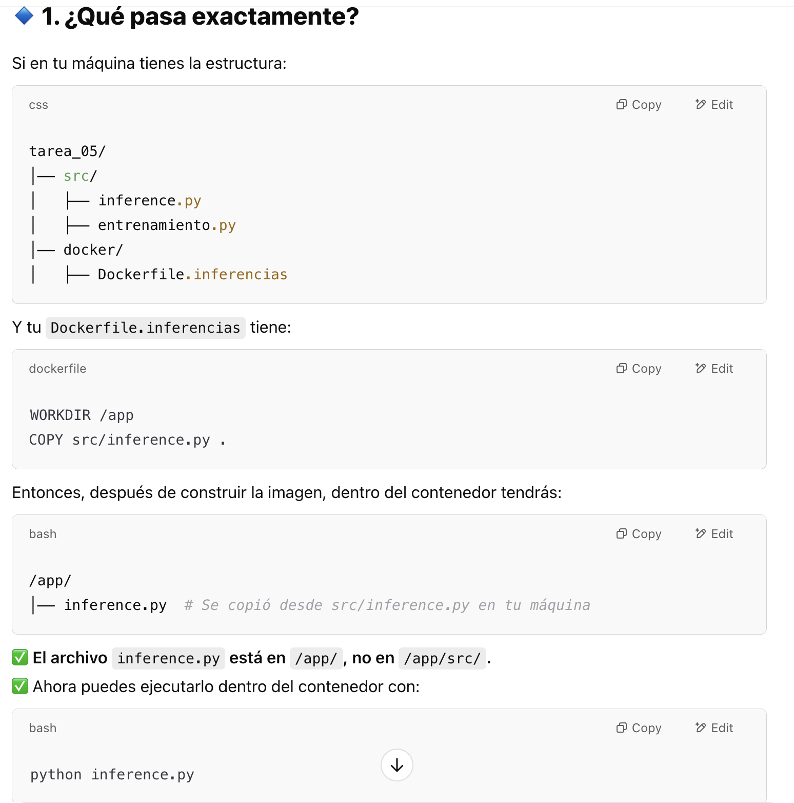

# Construcción de las imagenes

docker build -f docker/Dockerfile.entrenamiento -t entrenamiento_modelo .
docker build -f docker/Dockerfile.inferencias -t inferencias_modelo .

# Ejecutar los contenedores con volúmenes

docker run --rm \
    -v $(pwd)/data:/app/data \
    -v $(pwd)/src:/app/src \
    -v $(pwd)/models:/app/models \
    entrenamiento_modelo \
    --train_path "/app/data/prep_train.csv" \
    --model_output "/app/models/model.joblib"

docker run → Crea y ejecuta un contenedor basado en la imagen entrenamiento_modelo.
--rm → Borra automáticamente el contenedor una vez que la ejecución finaliza.
✅ Esto evita acumulación de contenedores innecesarios.

-v → Indica que estamos montando un volumen (compartiendo una carpeta entre la máquina anfitriona y el contenedor).
$(pwd)/data → Carpeta en tu máquina local que contiene los datos (data/).
/app/data → Carpeta dentro del contenedor donde se montarán los datos.
✅ Ventaja: Los datos no se copian al contenedor, sino que se acceden directamente desde tu máquina.

entrenamiento_modelo: Es el nombre de la imagen que se usará para crear el contenedor.

Agumentos del entrenaiento:

--train_path "/app/data/prep_train.csv"
📂 Especifica el archivo de entrenamiento dentro del contenedor.
🔄 Como data/ está montado, prep_train.csv sigue siendo el mismo archivo de tu máquina.

--model_output "/app/models/model.joblib"
💾 Define dónde se guardará el modelo entrenado.
🔄 Como models/ está montado, el modelo se guarda en tu máquina local, no dentro del contenedor.

#################

En tu script entrenamiento.py, estás usando la ruta:

train = pd.read_csv("../data/prep_train.csv")

❌ Esto está mal porque dentro del contenedor, data/ está en /app/data/, no en ../data/.

###############

COPY src /app/src

✅ Primer src (fuente) → Se refiere a la carpeta src/ en tu máquina local (ubicada en tarea_05/src/).
✅ Segundo src (destino) → Se refiere a la carpeta donde se copiará dentro del contenedor (/app/src/).

COPY src/inference.py .
 src/inference.py → Es el archivo de tu máquina local que está dentro de la carpeta src/.
2️⃣ . (punto) → Es el destino dentro del contenedor, que se refiere al directorio de trabajo actual (WORKDIR).

